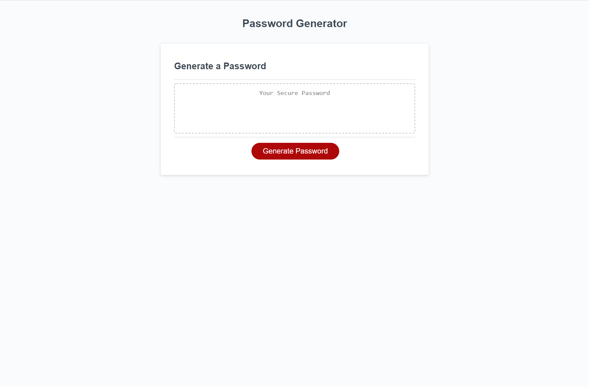

# Password Generator

## Description

This password generator will create a random, dynamic password based on your own input. It will take in how long you want your password to be and whether or not you want to include specific types of characters.

## Usage
To create a password, first, click the button and you will be prompted with a question on how many characters you want in your password. The generator will only all a number between 8 and 128. If you do not enter a valid number (between 8 and 128) it will not continue.

After you have decided on the length of the password, you will be given a series of confirms to decide the types of characters to populate your password. Clicking "confirm" will add that type of character to the password and clicking "cancel" will omit them. You will be given the choice to include four different types: lowercase alphebetical letters, uppercase alphabetical letters, numbers and special characters. For the password to successfully generate, you must select at least one type of character, otherwise you will be given an alert to choose at least one.

After finishing the mentioned steps, your new password will be generated!

## Website Link
[Password Generator](https://rgl10d.github.io/password-generator/)

## License
MIT License

Copyright © [2020] [Garrett Lee]

Permission is hereby granted, free of charge, to any person obtaining a copy
of this software and associated documentation files (the "Software"), to deal
in the Software without restriction, including without limitation the rights
to use, copy, modify, merge, publish, distribute, sublicense, and/or sell
copies of the Software, and to permit persons to whom the Software is
furnished to do so, subject to the following conditions:

The above copyright notice and this permission notice shall be included in all
copies or substantial portions of the Software.

THE SOFTWARE IS PROVIDED "AS IS", WITHOUT WARRANTY OF ANY KIND, EXPRESS OR
IMPLIED, INCLUDING BUT NOT LIMITED TO THE WARRANTIES OF MERCHANTABILITY,
FITNESS FOR A PARTICULAR PURPOSE AND NONINFRINGEMENT. IN NO EVENT SHALL THE
AUTHORS OR COPYRIGHT HOLDERS BE LIABLE FOR ANY CLAIM, DAMAGES OR OTHER
LIABILITY, WHETHER IN AN ACTION OF CONTRACT, TORT OR OTHERWISE, ARISING FROM,
OUT OF OR IN CONNECTION WITH THE SOFTWARE OR THE USE OR OTHER DEALINGS IN THE
SOFTWARE.

